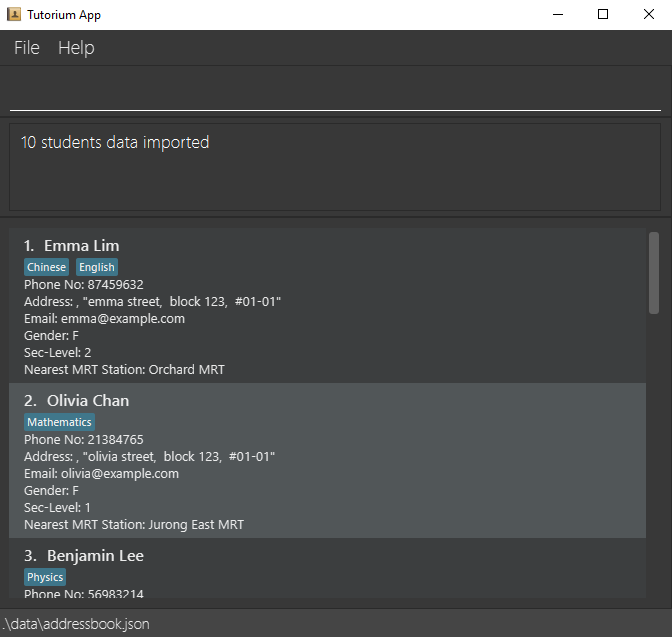
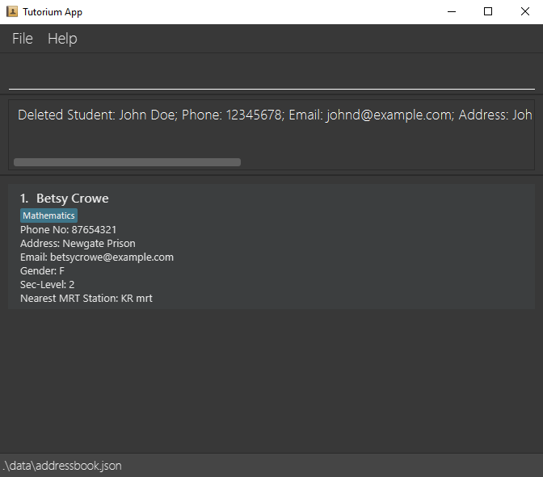
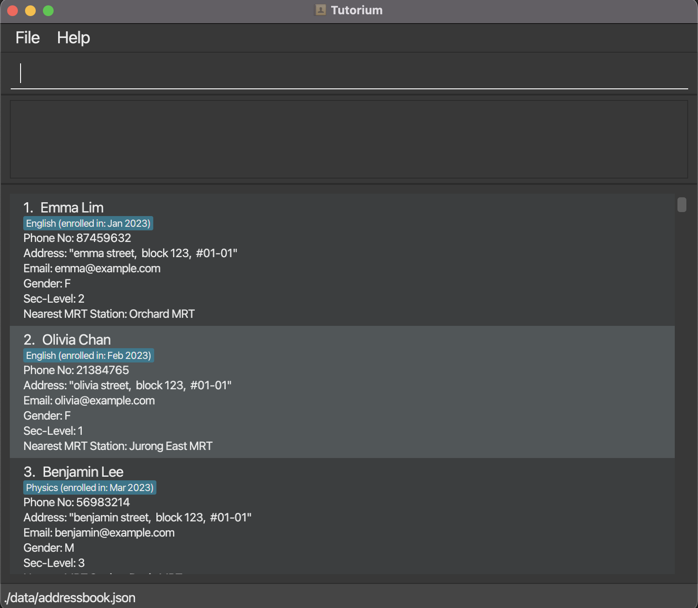
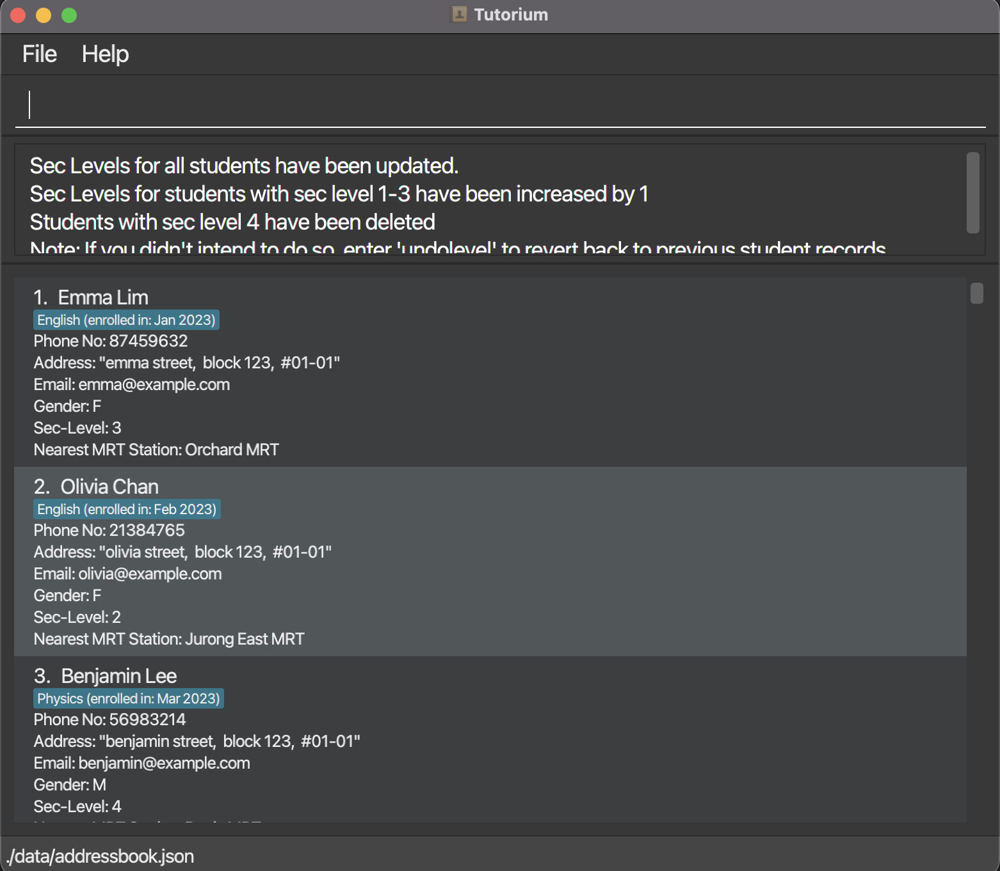
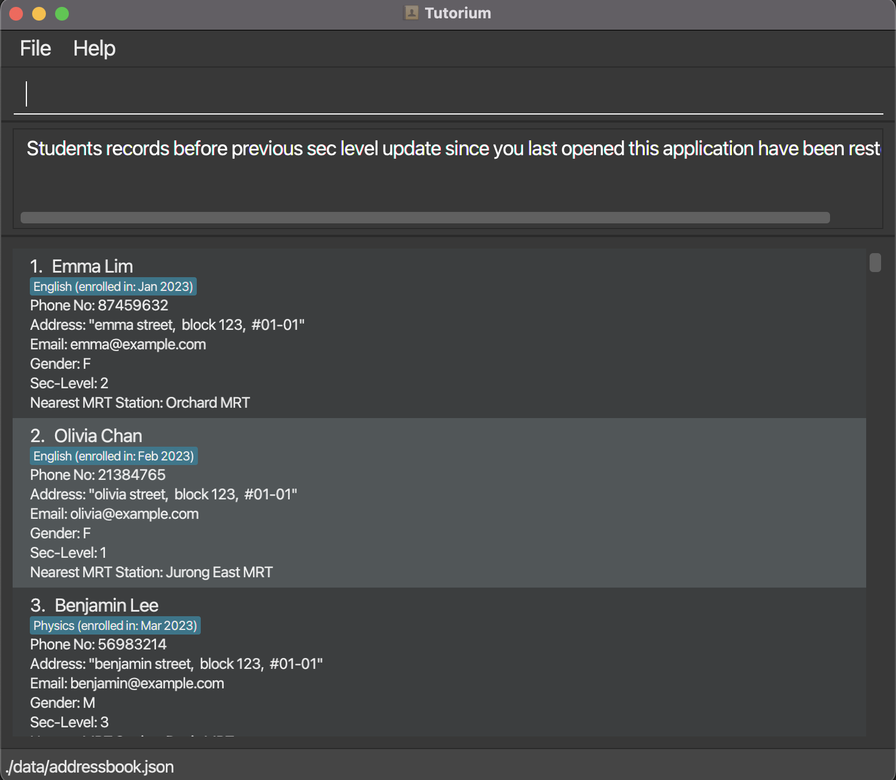
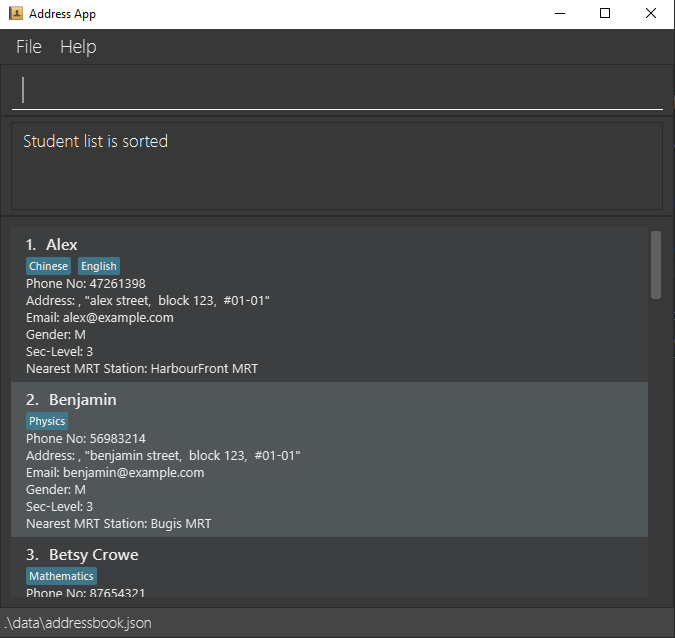
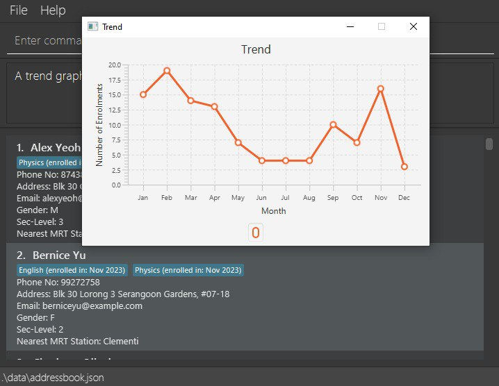

# Tutorium User Guide

Welcome to Tutorium! Tutorium is a **desktop application for tuition centre administrative staff** to conduct data analysis for the planning of marketing strategies. Users can interact with it using a Command Line Interface (CLI).

<box type="info" seamless>

**What is CLI?** 
Command line interface (CLI) is an interface we use to interact with the computer using only the keyboard and text.

In contrast, a graphical user interface (GUI) is how you interact with the computer using a mouse, finding and clicking menus, buttons and icons.

**Why CLI?** 

CLI enables you to execute commands quickly and become a more efficient person!

</box>

Tutorium supports administrative work relating to students from Secondary 1 to Secondary 4, under the O-Level and IP systems in Singapore.

In this user guide, you will find instructions on how to install Tutorium and use its many features to manage and make use of the students' data.
From having Tutorium installed to making the best use out of Tutorium, this user guide has everything you need. Head over to the [Quick Start](#quick-start) section to get onboard!

Choose a topic from the [table of contents](#table-of-contents) below to find out how to use Tutorium!

--------------------------------------------------------------------------------------------------------------------

# How to Use This User Guide

1. This user guide consists of four main sections, namely Quick Start, Features, Command Summary, FAQ and Known Issues.
   1. Quick Start: Guide you to set up Tutorium.
   2. Features: Guide for using Tutorium features.
   3. Command Summary: A summary of all available commands. 
   4. FAQ: List of frequently asked questions. 
   5. Known Issues: Issues that currently exist which the developer will fix.

1. By clicking the link in Table of Contents, you will be directed to the details of the section you're interested in.

1. By clicking the [↑ Back to table of contents] at the bottom of each section, you will be directed back to the table of contents.

### Icon Coloured Boxes

Throughout this user guide, you may observe coloured boxes that provide useful information with an icon on its top-left
indicating the type of information present.

**<box type="tip" seamless>** 
Tips empower you to make full use of Tutorium.
</box>

--------------------------------------------------------------------------------------------------------------------

# Table of Contents

<!-- * Table of Contents -->
<page-nav-print />

--------------------------------------------------------------------------------------------------------------------

## Quick Start

1. Ensure you have Java `11` or above installed in your computer.

1. Download the latest `tutorium.jar` file from [here](https://github.com/AY2324S1-CS2103T-W13-2/tp/releases).

1. Copy the file to the folder you want to use as the _home folder_ for the Tutorium app.

1. Double click the file to launch it.

<box type="info" seamless>
Alternately, you can use the CLI to launch Tutorium.

1. Open a command terminal. If you are using Windows, press the Windows key + R on your keyboard, type `cmd` and press Enter.
If you are using Mac, click on the Launchpad icon in the Dock, type Terminal in the search field, and then click Terminal.

1. "Go into" the folder you put the `tutorium.jar` file in using cd command. For example, if you put it in a folder named `Downloa`, then type this command into the terminal: `cd Tutorium`

1. Key the `java -jar tutorium.jar` command in the terminal to run the application. 

</box>

1. A GUI similar to the below should appear in a few seconds. Note that the app contains some sample data. 
   

1. Type the command in the command box and press Enter to execute it. i.e. typing **`help`** and pressing Enter will open the help window. 
   Some example commands you can try:

    * `list` : Lists all students.

    * `add n/John Doe p/12345678 e/johnd@example.com a/John street, block 123, #01-01 g/M l/2 m/KR mrt s/English` : Adds a student named `John Doe` to the Address Book.

    * `delete John Doe` : Deletes the student with the matching name in the current list.

    * `clear` : Deletes the data of all students.

    * `exit` : Exits the app.

1. Refer to the [Features](#features) below for details of each command.
--------------------------------------------------------------------------------------------------------------------
## Features

<box type="info" seamless>

**Notes about the command format:** 

* Words in `UPPER_CASE` are the parameters to be supplied by the user. 
  e.g. in `add n/NAME`, `NAME` is a parameter which can be used as `add n/John Doe`.

* Items in square brackets are optional. 
  e.g `n/NAME [s/SUBJECT]` can be used as `n/John Doe s/English` or as `n/John Doe`.

* Items with `…`​ after them can be used multiple times including zero times. 
  e.g. `[s/SUBJECT]…​` can be used as ` ` (i.e. 0 times), `s/English`, `s/English s/Chinese` etc.

* When providing parameters starting with any of the prefixes used by Tutorium `(n/, p/, e/, a/, g/, l/, n/, s/ and d/)` to fields,
  users should not add spaces between the prefix for that field and the input value.
  e.g. Filtering students with the address `e/house` should be done with the command `filter a/e/house` rather than `filter a/ e/house`.

* Parameters containing words (other than the first word) that start with any of the prefixes used by Tutorium `(n/, p/, e/, a/, g/, l/, n/, s/ and d/)`
  are not accepted in Tutorium.

* Parameters can be in any order. 
  e.g. if the command specifies `n/NAME p/PHONE_NUMBER`, `p/PHONE_NUMBER n/NAME` is also acceptable.

* For commands that take in index (e.g. delete, edit), the index can only be an integer from 1 to 2,147,483,647, otherwise an invalid command message will be displayed.

* Extraneous parameters for commands that do not take in parameters (such as `help`, `list`, `exit` and `clear`) will be ignored. 
  e.g. if the command specifies `help 123`, it will be interpreted as `help`.

* The accepted range of sec levels is from Secondary 1 to Secondary 4.

* If no enrol date is provided, the date on which the command was executed will be applied to all subjects listed in the command.
    * If only 1 enrol date is provided, the same enrol date will be applied to all subjects listed.
    * If the number of enrol dates provided is the same as the number of subjects listed, the order in which enrol dates are applied to subjects will be the same as the order in which they are provided.
    * Any mismatch between the number of subjects and the number of enrol dates provided (other than the cases listed above) will result in an error.

* Simply providing 1 enrol date without providing any corresponding subject(s) will result in an error.

* If you are using a PDF version of this document, be careful when copying and pasting commands that span multiple lines as space characters surrounding line-breaks may be omitted when copied over to the application.
  </box>

[↑ Back to table of contents](#table-of-contents)

### View help : `help`

Displays the URL for the User Guide.

Format: `help`

[↑ Back to table of contents](#table-of-contents)

### Add a student's data: `add`

Adds a student's data to the address book.

Format: `add n/NAME p/PHONE_NUMBER e/EMAIL a/ADDRESS g/GENDER l/SEC_LEVEL m/MRT_STATION [s/SUBJECT]… [d/ENROL_DATE]…​`

Examples:
* `add n/John Doe p/12345678 e/johnd@example.com a/John street, block 123, #01-01 g/M l/2 m/KR mrt s/Chemistry s/Physics`
* `add n/Betsy Crowe p/87654321 e/betsycrowe@example.com a/Newgate Prison g/F l/2 m/KR mrt s/Chinese`
   
  

[↑ Back to table of contents](#table-of-contents)

### Import data from .csv file: `import`

Imports students' data into Tutorium.
1. Move your .csv file into the folder containing Tutorium.
2. Enter the import command with the following format (shown below).

Format: `import FILENAME.csv`

<box type="tip" seamless>

**Note:**
- The columns should be "Name", "Phone", "Email", "Address", "Gender", "Sec level", "Nearest Mrt Station", "Subject", "Enrol Date"
- Enrol Date can be left blank
- There must be a Enrol Date header after every Subject header
- Example:

</box>

Examples:
* `import student_data.csv`
   
  

[↑ Back to table of contents](#table-of-contents)

### Edit a student's data : `edit`

Edits an existing student's data in the address book.

Format:
1. `edit INDEX prefix/FIELD_VALUE` or `edit NAME prefix/FIELD_VALUE` (you can specify the student you want to edit by index or by his/her name)
2. `edit INDEX prefix1/FIELD_1_VALUE prefix2/FIELD_2_VALUE`  or `edit NAME prefix1/FIELD_1_VALUE prefix2/FIELD_2_VALUE prefix3/FIELD_3_VALUE` (change multiple fields)

* At least one field to edit must be provided.
* Existing values will be updated to the input values.

Examples:
*  `edit John Doe n/Joe` edits John Doe's name to "Joe".
*  `edit 2 n/joey e/joey123@example.com` Edits the student (with index 2)'s name and email to be `joey` and `joey123@example.com` respectively.
    
   

[↑ Back to table of contents](#table-of-contents)

### Search for data : `search`

Searches for people whose names contain the given keyword.

Format: `search KEYWORD`

* The search is case-insensitive. e.g `joe` will match `Joe`
* Only the name is searched.
* Partial words can be matched. e.g. `Han` will match `Hans`
* All students matching the keyword will be returned (i.e. `OR` search).
  e.g. `Alfred` will return `alfred`, `Alfred Tan`

Examples:
* `search Lee` returns `Benjamin Lee` and `Eva Lee` 
   
  

[↑ Back to table of contents](#table-of-contents)

### Delete data : `delete`

Deletes data of a specified student.

Format: `delete NAME` or `delete INDEX`

* Deletes the student with the specified `NAME` or `INDEX`.
* `NAME`: The deletion is case-insensitive, but it must be the full name of the student.

Examples:
* `delete John Doe`
* `delete 1`
   
  

[↑ Back to table of contents](#table-of-contents)

### Update sec level : `uplevel`, `undolevel`

- `uplevel` : update the sec levels for all students and remove all sec level 4 students.
- `undolevel` : revert the student record to be before previous sec level update (to undo an `uplevel`).

  Format: `uplevel`, `undolevel`

* Command is case-sensitive.
* No prefix is required, only the command.
* Note that `undolevel` feature is provided in case the user accidentally enters `uplevel` AND the user does not close the application immediately.
* That means after doing `uplevel`, followed by any other `edit`, `add` or `delete` commands etc and then do `undolevel`, the commands in between will be invalid because the students records are reverted back to before the previous `uplevel`.
* `undolevel` can be performed only when there is / are `uplevel` performed (and has not been undone) since user open application.

Examples: `uplevel`, `undolevel`

  

  

  

[↑ Back to table of contents](#table-of-contents)

### Filter data : `filter`

Shows the list of students data that fulfills all given conditions.

Format: `filter prefix/FIELD_VALUE [MORE FIELDS]`

* FIELD_VALUE: Case-sensitive string.
* The student list shows only the students whose data fulfills all given conditions.
* At least one condition must be provided.
* All fields can be filtered except for the name and enrol date fields. When looking for students with a certain name or keyword in their name, refer to the section on the search feature.

Examples:
* `filter g/F s/English s/Physics`
* `filter s/Physics` returns all students taking the Physics subject  
   
  

[↑ Back to table of contents](#table-of-contents)

### Sort data : `sort`

Sorts the list of students data permanently by name in ascending or descending.

Format: `sort in/SEQUENCE`

* `SEQUENCE` should be `ASC` or `DESC`, non-case-sensitive.

Examples:
* `sort in/ASC`  
  

[↑ Back to table of contents](#table-of-contents)

### Clear all entries : `clear`

Clears all entries from the address book.

Format: `clear`

[↑ Back to table of contents](#table-of-contents)

### Show statistical table: `table`
Shows a table either categorized by gender, sec level or subject.

Format: `table PREFIX`

* FIELD_VALUE is not needed.
* prefix is case-sensitive.
* Exactly one of `g/`, `l/`, `s/` or `d/yyyy` must be provided.
* For `d/yyyy`, `yyyy` represents year in 4 digits.

Examples:
* `table g/` will show a table categorized by student gender.
* `table l/` will show a table categorized by student sec level.
* `table s/` will show a table categorized by student subject.
* `table d/2023` will show a table categorized by months in year 2023.

[↑ Back to table of contents](#table-of-contents)

### Show bar chart: `bar`
Shows a bar chart either categorized by gender, sec level or subject.

Format: `bar PREFIX`

* FIELD_VALUE is not needed.
* prefix is case-sensitive.
* Exactly one of `g/`, `l/`, or `s/` must be provided.
* For `d/yyyy`, `yyyy` represents year in 4 digits.

Examples:
* `bar g/` will show a bar chart categorized by student gender.
* `bar l/` will show a bar chart categorized by student sec level.
* `bar s/` will show a bar chart categorized by student subject.
* `bar d/2023` will show a bar chart categorized by months in year 2023.

Below is the chart generated after entering `bar l/`.

  

[↑ Back to table of contents](#table-of-contents)

### Show line chart: `trend`
Shows a line chart describing number of students enrolled in each month in a specific year.

Format: `trend y/YEAR`

* Students will be categorised according to their earliest enrol date. i.e. if John Doe enrolled in Physics in May 2020
and Chemistry in July 2021, his data will be found in the line chart shown when `trend y/2020` is used, but not in the line chart shown
when `trend y/2021` is used.

Examples:
* `trend y/2023` will show a line chart describing number of students enrolled
in each month in year 2023.

Below is the chart generated after typing `trend y/2023`
   

[↑ Back to table of contents](#table-of-contents)

### Export visual representation : `export`

Exports the statistical table or bar chart into PNG format.

Format: `export v/VISUAL`

* `VISUAL` should be `TABLE` or `BAR`, non-case-sensitive.
* `TABLE` indicates exporting the table created, while `BAR` indicates exporting the bar chart created.
* A table should be created before exporting, this applies to exporting bar chart as well.
* The visual representation exported for each type of visual will be the one that is most recently created.
  * i.e. if two bar charts are created consecutively, `export v/BAR` will export the most recent bar chart created (the 2nd bar chart)

Examples:
* `export v/TABLE`  

[↑ Back to table of contents](#table-of-contents)

### Exit program : `exit`

Exits the program.

Format: `exit`

[↑ Back to table of contents](#table-of-contents)

### Archive data files `[coming in v2.0]`

_Details coming soon ..._

[↑ Back to table of contents](#table-of-contents)

--------------------------------------------------------------------------------------------------------------------

## Additional Info

### Save data

Tutorium data are saved in the hard disk automatically after any command that changes the data. There is no need to save manually.

[↑ Back to table of contents](#table-of-contents)

### Edit data file

Tutorium data are saved automatically as a JSON file `[JAR file location]/data/addressbook.json`. Advanced users are welcome to update data directly by editing that data file.

<box type="warning" seamless>

**Caution:**
If your changes to the data file makes its format invalid, Tutorium will discard all data and start with an empty data file at the next run.  Hence, it is recommended to make a backup of the file before editing it.
</box>

[↑ Back to table of contents](#table-of-contents)

--------------------------------------------------------------------------------------------------------------------

## Command Summary

Action     | Format, Examples
-----------|----------------------------------------------------------------------------------------------------------------------------------------------------------------------
**Help**   | `help`
**Add**    | `add n/NAME p/PHONE_NUMBER e/EMAIL a/ADDRESS g/GENDER l/SEC_LEVEL m/MRT STATION [s/SUBJECT]…​`   e.g., `add n/John Doe p/98765432 e/johnd@example.com a/John street, block 123, #01-01 s/Chemistry`
**Import** | `import FILENAME.csv`  e.g., `import student_data.csv`
**Edit**   | `edit INDEX prefix1/[field1] prefix2/[field2]`    or `edit NAME prefix/[field] prefix/[field] prefix/[field]`   e.g., `edit John Doe n/Joe e/johndoe@example.com t/English`
**Search** | `search [KEYWORD]`  e.g., `search Lee`
**Delete** | `delete INDEX`  or `delete NAME`   e.g., `delete Joe`
**Update** | `uplevel`  or `undolevel`  
**Filter** | `filter prefix/FIELD_VALUE [MORE FIELDS]`   e.g., `filter g/F s/English s/Physics`
**Sort**   | `sort in/[DESCRIPTION]`   e.g., `sort in/ASC`
**Clear**  | `clear`
**Show Table** | `table prefix/`  or `table d/YEAR`  
**Show Bar Chart** | `bar prefix/`  or `bar d/YEAR`  
**Show Line Chart** | `trend y/{year}`
**Export**   | `export v/VISUAL`   e.g., `export v/table`
**Exit**   | `exit`

[↑ Back to table of contents](#table-of-contents)

--------------------------------------------------------------------------------------------------------------------

## FAQ

**Q**: How do I transfer my data to another computer? 
**A**: Install the app in the other computer. Next, overwrite the data file created on launching the app with the file containing your Tutorium data.

**Q**: How do I save my progress?
**A**: Your progress is automatically saved after each command.

[↑ Back to table of contents](#table-of-contents)

--------------------------------------------------------------------------------------------------------------------

## Known Issues

1. **When using multiple screens**, if you move the application to a secondary screen, and later switch to using only the primary screen, the GUI will open off-screen. The remedy is to delete the `preferences.json` file created by the application before running the application again.

[↑ Back to table of contents](#table-of-contents)
